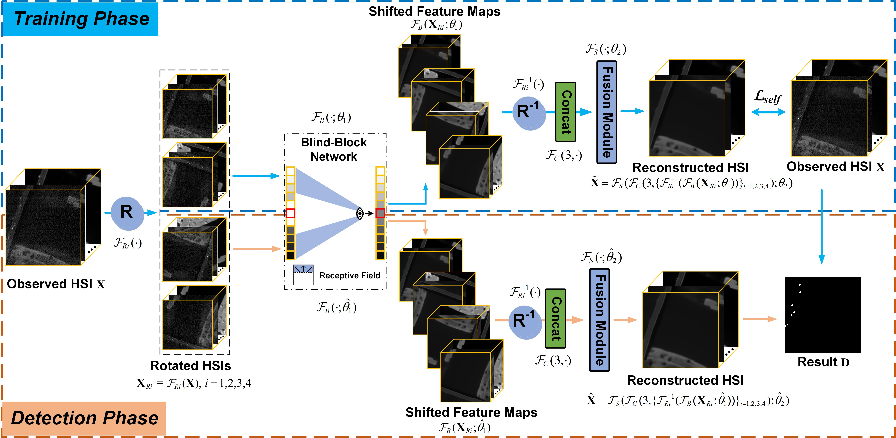

# BockNet
This is the official repository for  ["BockNet: Blind-Block Reconstruction Network with a Guard Window for Hyperspectral Anomaly Detection"](https://ieeexplore.ieee.org/document/10330742) in IEEE Transactions on Geoscience and Remote Sensing (TGRS). 



## Abstract

Hyperspectral anomaly detection (HAD) aims to identify anomalous targets that deviate from the surrounding background in unlabeled hyperspectral images (HSIs). Most existing deep networks that exploit reconstruction errors to detect anomalies are prone to fit anomalous pixels, thus yielding small reconstruction errors for anomalies, which is not favorable for separating targets from HSIs. In order to achieve a superior background reconstruction network for HAD purposes, this paper proposes a self-supervised blind-block network (termed BockNet) with a guard window. BockNet creates a blind-block (guard window) in the center of the network's receptive field, rendering it unable to see the information inside the guard window when reconstructing the central pixel. This process seamlessly embeds a sliding dual-window model into our BockNet, in which the inner window is the guard window and the outer window is the receptive field outside the guard window. Naturally, BockNet utilizes only the outer window information to predict/reconstruct the central pixel of the perceptive field. During the reconstruction of pixels inside anomalous targets of varying sizes, the targets typically fall into the guard window, weakening the contribution of anomalies to the reconstruction results so that those reconstructed pixels converge to the background distribution of the outer window area. Accordingly, the reconstructed HSI can be deemed as a pure background HSI, and the reconstruction error of anomalous pixels will be further enlarged, thus improving the discrimination ability of the BockNet model for anomalies. Extensive experiments on four datasets illustrate the competitive and satisfactory performance of our BockNet compared to other state-of-the-art detectors.

## Setup

### Requirements

Our experiments are done with:

- Python 3.9.12
- PyTorch 1.12.1
- numpy 1.21.5
- scipy 1.7.3
- torchvision 0.13.1

## Prepare Dataset

Put the data(.mat [data, map]) into ./data

## Training and Testing

### Training
```shell
python main.py --command train --dataset Beach --epochs 3000 --learning_rate 1e-4 --blindspot 15 --gpu_ids 0
```

### Testing
```shell
python main.py --command predict --dataset Beach --epochs 3000 --learning_rate 1e-4 --blindspot 15 --gpu_ids 0
```

- If you want to Train and Test your own data, you can change the input dataset name (dataset) and tune the parameters, such as Learning rate (learning_rate), Width of guard window (blindspot).

## Citation

If the work or the code is helpful, please cite the paper:

```
@article{wang2023bocknet,
  author={Wang, Degang and Zhuang, Lina and Gao, Lianru and Sun, Xu and Huang, Min and Plaza, Antonio},
  journal={IEEE Trans. Geosci. Remote Sens.}, 
  title={{BockNet}: Blind-Block Reconstruction Network with a Guard Window for Hyperspectral Anomaly Detection}, 
  year={2023},
  volume={61},
  pages={1-16},
  DOI={10.1109/TGRS.2023.3335484}
}
```

## Acknowledgement

The codes are based on [High-Quality Self-Supervised Deep Image Denoising](https://github.com/COMP6248-Reproducability-Challenge/selfsupervised-denoising). Thanks for their awesome work.

## Contact
For further questions or details, please directly reach out to wangdegang20@mails.ucas.ac.cn
